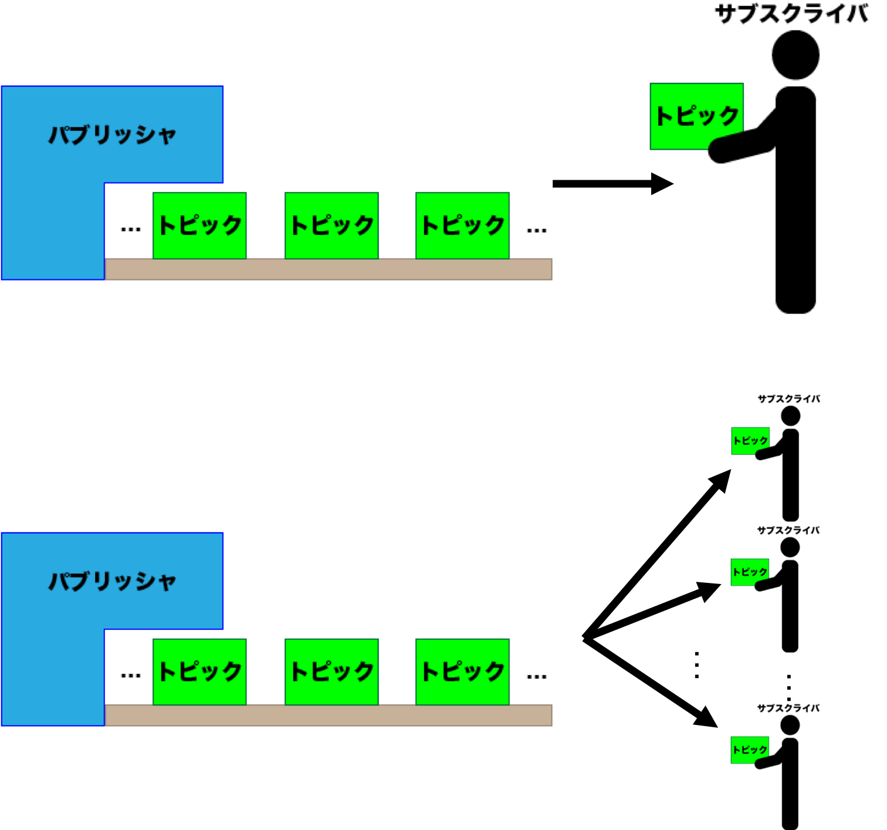
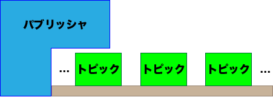
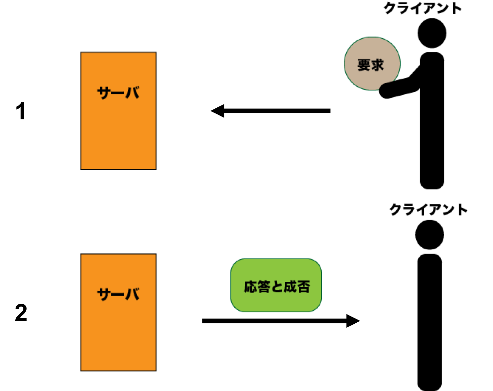
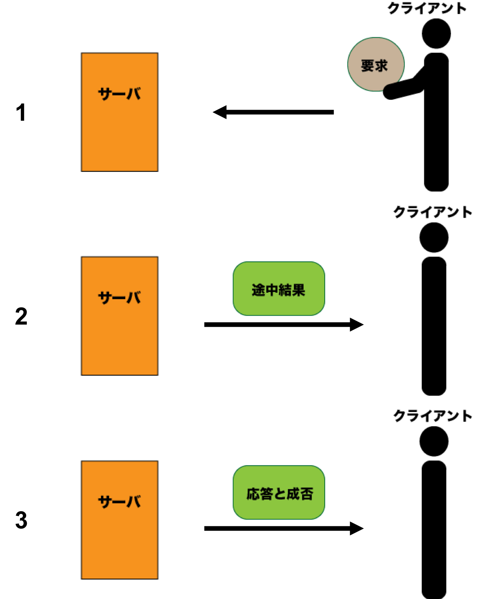

# ROSでよく使用する用語

## 一覧

* [ノード\(node\)](ros_word.md#node)
* [パッケージ\(package\)](ros_word.md#package)
* [マスタ\(master\)](ros_word.md#master)
* [トピック\(topic\)](ros_word.md#topic)
  * [パブリッシュ\(publish\)、パブリッシャ\(publisher\)](ros_word.md#publish)
  * [サブスクライブ\(subscribe\)、サブスクライバ\(subscriber\)](ros_word.md#subscribe)
  * [メッセージ\(message\)](ros_word.md#message)
* [サービス\(service\)](ros_word.md#service)
* [アクション\(action\)](ros_word.md#action)

## ノード\(node\)   

目的ごとの最小プロセスの名称です。主にROSではプログラムの一つ一つにノードが設定されており、ノード同士が通信を行うことで目的のシステムを形成します。

## パッケージ\(package\)   

目的に沿ったノードやメッセージ、サービス、アクション等のプログラムがひとまとまりになったものの名称です。

開発は主にパッケージ単位で行われます。

## マスタ\(master\)   

ROSにおいて、ノード同士が通信するための名前の管理を行っているところです。

`roscore`コマンドで起動しているのはマスタになります。このマスタが立ち上がっていないとノード同士が通信することが出来ません。

## トピック\(topic\)   

ノード間でやり取りするデータのことです。

相手の状態に関係なく、常にデータを発信しており、不特定多数がデータを受け取ることができます。つまり**1対1通信**だけでなく**1対多数通信**が行えるということです。

トピックの配信には「パブリッシャ」、トピックの購読には「サブスクライバ」を使用します。

### パブリッシュ\(publish\)、パブリッシャ\(publisher\)   

パブリッシュとは、「配信」を意味し、トピックの配信を行います。 パブリッシャは「配信者」となります。

パブリッシャは常にトピックを配信し続けています。下の図では製造ラインをイメージしています。

### サブスクライブ\(subscribe\)、サブスクライバ\(subscriber\)   

パブリッシャに対し、サブスクライブは「購読」を意味し、トピックの購読を行います。 サブスクライバは「購読者」となります。

パブリッシャによって配信されたトピックはサブスクライバで購読します。また複数のサブスクライバが同時に同じトピックを購読出来ます。

### メッセージ\(message\)   

メッセージは、トピックでデータをやり取りするときに用いる「入れ物」のことです。

データは、メッセージの入れ物の「型」に合わせてあげる必要があり、このメッセージをやり取りすることで、通信を行います。

## サービス\(service\)   

常に相手の状態に関係なく通信しているトピックに対し、サービスは要求があったときのみ応答します。サービスは要求するクライアントと応答するサーバと言い、クライアント側は応答の成否を知ることができます。

またトピックが**1対多数通信**が可能だったのに対し、サービスは1対1通信になります。 そのためトピックを**非同期通信**とすると、サービスは**同期通信**と言えます。

トピックではデータの「入れ物」にメッセージを使用しましたが、サービスではサービス用のファイル\(`.srv`\)を使用します。

## アクション\(action\)   

アクションはサービスと同じように、要求するクライアントと応答するサーバがあります。 しかしトピックやサービスと違う点として、アクションは処理が長く応答するまでの時間がかかる時に使用し、処理の途中結果を受け取ることが出来ます。そのため**1対1の非同期通信**になります。

トピックではデータの「入れ物」にメッセージを使用しましたが、サービスではサービス用のファイル\(`.action`\)を使用します。

