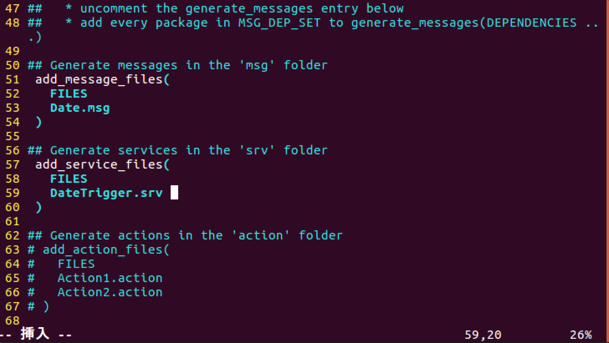

# 独自のサービスファイルの作り方

## ROSチュートリアルの流れ

1. [ROSパッケージの作り方](how_to_create_pkg.md)
2. [トピックの書き方](how_to_write_topic.md)
3. [独自のメッセージファイルの作り方](how_to_create_msg.md)
4. [まとめて起動するやり方](how_to_use_launch.md)
5. [サービスを書き方](how_to_write_service.md)
6. [独自のサービスファイルの作り方](how_to_create_srv.md) ←今ここ

## はじめに

この章では、独自のサービスファイルを作成し、ROSで使用する方法を解説します。

[独自のメッセージファイルの作り方](how_to_create_msg.md)で作成した日付と時間を配信するトピックを改良して、日付と時間を返すサービスを作成してみたいと思います。

## サービスファイルの書き方

独自のサービスファイルは、`srv`ディレクトリに置きます。 無い場合は`srv`ディレクトリを作りましょう。

```text
roscd ros_tutorial/
mkdir srv
```

要求に対し日時と時間を返すサービスを作成してみましょう。

```text
vim srv/DateTrigger.srv
```

`DateTrigger.srv`の中はこのように書きます。

```text
---
bool success
int32 date
float64 time
```

これは入力は何もなく、出力は`bool`の`success`と`int32`の`date`、`float64`の`time`を定義しています。

つまりサービスに対して、要求があったら`success`と`date`、`time`を返すということです。

次に`CMakeLists.txt`を編集します。

```text
roscd ros_tutorial/
vim CMakeLists.txt
```

57行目からの`add_service_files`のコメントアウトを外し、59行目に`DateTrigger.srv`を追加します。



`catkin_ws`に移動し、`catkin_make`を行います。

```text
cd ~/catkin_ws/
catkin_make
```

これで準備完了です。

`DateTrigger.srv`が使用できるか確認していきます。

```text
rossrv show ros_tutorial/DateTrigger
```

以下のように表示されたら、正しく作成できています。

```text
---
bool success
int32 date
float64 time
```

## プログラムを改良

### サーバ

まず`ros_tutorial`パッケージに移動します。

```text
roscd ros_tutorial
```

`time_pub2.py`をコピーして`date_server.py`という名前で保存しましょう。

```text
cp scripts/time_pub2.py scripts/date_server.py
vim scripts/date_server.py
```

プログラムを以下のように改良します。



```text
#!/usr/bin/env python                                                           
import rospy
from ros_tutorial.srv import DateTrigger, DateTriggerResponse
from datetime import datetime

def callback_srv(data):                                          #changed
    l = []
    d = DateTriggerResponse()                                                    
    d.date = ''                                                  #9~12 changed
    d.time = ''
    try:                                                         #add
        now = datetime.now()
        l = str(now)

        for i in range(0,10):
            d.date += l[i]
        for i in range(11,25):
            d.time += l[i]
        d.date = int(d.date.replace('-', ''))
        d.time = float(d.time.replace(':',''))
        d.success = True                                        #22~25 changed
    except:
        d.success = False
    return d

if __name__ == '__main__':
    rospy.init_node('date_server')                              #changed
    srv = rospy.Service('date_call', DateTrigger, callback_srv) #changed
    rospy.spin()
```



実行権限を与えます。

```text
chmod +x scripts/date_server.py
```

### コード解説

`time_pub2.py`から変更したところを解説していきます。

```text
from ros_tutorial.srv import DateTrigger, DateTriggerResponse
```

今回作成したサービスファイルをインポートします。

```text
def callback_srv(data):
```

`callback_srv`という関数名で定義してます。

```text
d = DateTriggereResponse()
```

`DateTriggereResponse`を`d`という名前でインスタンス化しています。

```text
    try:
        now = datetime.now()
        l = str(now)

        for i in range(0,10):
            d.date += l[i]
        for i in range(11,25):
            d.time += l[i]
        d.date = int(d.date.replace('-', ''))
        d.time = float(d.time.replace(':',''))
        d.success = True
```

処理自体は同じですが、最後に`return d`で`DateTriggerResponse`を返しています。

```text
    except:
        d.success = False
    return d
```

失敗の場合は`False`を返します。

### クライアント

10カウントごとに時刻を取得するプログラムを書きます。

`date_client.py`という名前で作成しましょう。

```
vim scripts/date_client.py
```

```
#!/usr/bin/env python                                                           
import rospy
from ros_tutorial.srv import DateTrigger

class Client():
    def __init__(self):
        self.call = rospy.ServiceProxy('date_call', DateTrigger)
        self.res = ""

    def call(self):
        for i in  range(11):
            print(i)
            rospy.sleep(0.1)
        self.res = self.call()
        print("~~~~~~~~~~~~~~~~~~~~~~")
        print(self.res)
        print("~~~~~~~~~~~~~~~~~~~~~~")
        rospy.sleep(1)

if __name__ == '__main__':
    rospy.init_node("date_client")
    rospy.wait_for_service("date_call")
    c = Client()
    rate = rospy.Rate(10)
    while not rospy.is_shutdown():
        c.call()
        rate.sleep()
```

実行権限を与えます。

```text
chmod +x scripts/date_client.py
```

### コード解説

まずClientクラスから説明していきます。

```
    def __init__(self):
        self.call = rospy.ServiceProxy('date_call', DateTrigger)
        self.res = ""
```

`__init__`関数では今回呼び出すサービスの`date_call`を`self.call`という名前で宣言しています。
`self.res`は`self.call`で呼び出したサービスのレスポンスを受け取るための変数です。

```
    def call(self):
        for i in  range(11):
            print(i)
            rospy.sleep(0.1)
        self.res = self.call()
        print("~~~~~~~~~~~~~~~~~~~~~~")
        print(self.res)
        print("~~~~~~~~~~~~~~~~~~~~~~")
        rospy.sleep(1)
```

`date_call`関数では10カウントした後、`self.res = self.call()`で結果を受け取り表示させています。

```
if __name__ == '__main__':
    rospy.init_node("date_client")
    rospy.wait_for_service("date_call")
```

`date_client`というノード名で宣言し、`date_call`が立ち上がるのを待っています。

```
    c = Client()
    rate = rospy.Rate(10)
    while not rospy.is_shutdown():
        c.call()
        rate.sleep()
```

`Client`クラスを`c`という名前でインスタンス化し、プログラムが終了するまで`call`関数を呼び出しています。

## 実行方法

それぞれ別のターミナルで実行してください。

```text
roscore
```

```text
rosrun ros_tutorial date_server.py
```

```text
rosrun ros_tutorial date_client.py
```

## 実行結果

`date_client.py`を実行したターミナルで以下のように表示されたら正しく実行できています。

```text
0
1
2
3
4
5
6
7
8
9
10
~~~~~~~~~~~~~~~~~~~~~~
success: True
date: 20181114
time: 123304.60767
~~~~~~~~~~~~~~~~~~~~~~
```

2018年11月14日の12時33分4.60767秒を指しています。

