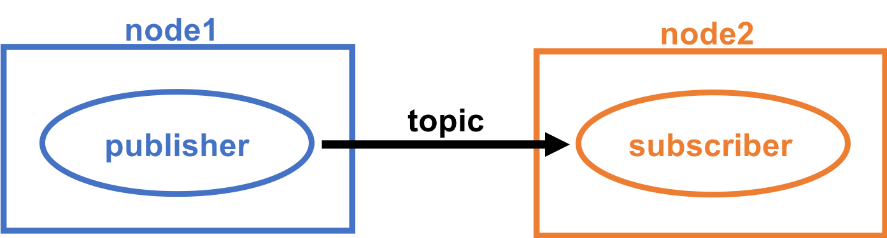

# トピックの書き方

## ROSチュートリアルの流れ

1. [ROSパッケージの作り方](how_to_create_pkg.md)
2. [トピックの書き方](how_to_write_topic.md) ←今ここ
3. [独自のメッセージファイルの作り方](how_to_create_msg.md)
4. [まとめて起動するやり方](how_to_use_launch.md)　
5. [サービスの書き方](how_to_write_service.md)
6. [独自のサービスファイルの作り方](how_to_create_srv.md)

## はじめに

ROSでは、使用するプログラム言語として主に**Python**と**C++**が用いられますが、このチュートリアルでは**Python**を使用したいと思います。

ROSの通信方式は主に**トピック、サービス、アクション**の3つあります。この章では最も使用されることが多いトピックから説明していきます。

まず、トピックで使用されるパブリッシャ\(publisher\)とサブスクライバ\(subscriber\)ついて説明します。

この2つは、ノード間をトピックを介してデータをやり取りするときに使用され、 簡易的に説明するとこうなります。

* パブリッシャ : データを配信
* サブスクライバ : データを受け取る



やり取りするデータはメッセージの指定された型に入れ配信されます。

詳しくは[ROSでよく使用する用語](appendix/ros_word.md#topic)を御覧ください。

メッセージは、標準パッケージの**std\_msgs**の他に、自分で定義することもできます。

それではパブリッシャとサブスクライバを書いていきましょう。

まず[ROSパッケージの作り方](how_to_create_pkg.md)で作成した`ros_tutorial`に移動します。

Pythonのプログラムはscriptsディレクトリの中で作成します。 scriptsディレクトリが無い場合は作成しましょう。

```text
roscd ros_tutorial
mkdir scripts
```

## パブリッシャ

今回は、現在時刻を送るプログラムを書いていきます。

プログラム名は`time_pub.py`とします。

```text
vim scripts/time_pub.py
```

```text
#!/usr/bin/env python
import rospy
from std_msgs.msg import Float64

rospy.init_node('time_pub')
pub = rospy.Publisher('UnixTime', Float64 , queue_size=1)

rate = rospy.Rate(10)
while not rospy.is_shutdown():
    now = rospy.get_time()
    pub.publish(now)
    rate.sleep()
```

書いたプログラムには以下のコマンドを実行してください。

```text
chmod +x scripts/time_pub.py
```

これはプログラムに実行権限を与えています。

**Python**の場合は、プログラムに対し`chmod +x <プログラム名>`を行い、一度実行権限を与えれば、変更のたびに`catkin_make`は必要ありません。

### コード解説

```text
#!/usr/bin/env python
```

Pythonでプログラムを書くときのお約束で、シバンといいます。

```text
import rospy
```

`rospy`というモジュールをインポートしています。`rospy`はPythonでROSを扱うときに使用します。

```text
from std_msgs.msg import Float64
```

`std_msgs`の`Float64`という型のメッセージをインポートしています。`Float64`は浮動小数点変数の64ビットという意味です。

```text
rospy.init_node('time_pub')
```

`time_pub`というノードを定義しています。

```text
pub = rospy.Publisher('UnixTime', Float64 , queue_size=1)
```

`UnixTime`というトピック名、`Float64`というメッセージの型、`queue_size`が1のパブリッシャを定義しています。`queue_size`はバッファの数で、10 \[Hz\]周期でパブリッシュするときは1でも大丈夫です。10 \[Hz\]以上の周期でパブリッシュするときや複数のメッセージをパブリッシュするときは大きい値にするといいでしょう。

```text
rate = rospy.Rate(10)
while not rospy.is_shutdown():
    now = rospy.get_time()
    pub.publish(now)
    rate.sleep()
```

`now = rospy.get_time()`は`now`という変数に現在のUnixTimeを代入しています。

`pub.publish(now)`は`now`をパブリッシュしています。

シャットダウンされるまで10 \[Hz\] 周期で上記の2つを行っています。

## サブスクライバ

次にサブスクライバを書きます。

サブスクライバは`time_sub.py`とします。

```text
vim scripts/time_sub.py
```

```text
#!/usr/bin/env python
import rospy
from std_msgs.msg import Float64

def callback(message):
    print(message.data)

if __name__ == "__main__":
    rospy.init_node('time_sub')
    sub = rospy.Subscriber('UnixTime', Float64 , callback)
    rospy.spin()
```

パブリッシャと同様に以下のコマンドを実行してください。

```text
chmod +x scripts/time_sub.py
```

### コード解説

```text
#!/usr/bin/env python
import rospy
from std_msgs.msg import Float64
```

ここまでパブリッシャと同じです。

```text
def callback(message):
    print(message.data)
```

callback関数を定義しています。

`message.data`というのは、Float64の中のdataを参照するという意味です。

```text
if __name__ == "__main__":
```

Pythonではプログラムがインポートされた場合、関数を自動で実行してしまいますが、 このif文内に書いた関数は自動で実行されなくなります。

```text
    rospy.init_node('time_sub')
```

`time_sub`というノードを定義しています。

```text
    sub = rospy.Subscriber('UnixTime', Float64 , callback)
```

サブスクライバの宣言をしています。

パブリッシャが`UnixTime`という名前のトピック、`Float64`という型で配信しているため、こちらも合わせる必要があります。

最後の`callback`は、受け取った`Float64`型のデータを渡す関数を書く部分であり、今回はcallback関数に渡しています。

```text
    rospy.spin()
```

プログラムを終了させないようにしています。

## 相関図


## 実行方法

それぞれ別のターミナルでそれぞれを起動します。

```text
roscore
```

```text
rosrun ros_tutorial time_pub.py
```

```text
rosrun ros_tutorial time_sub.py
```

## 実行結果

`time_sub.py`を起動したとき、以下のように出力されたら正常に動作しています。

```text
$ rosrun ros_tutorial time_sub.py 
1540459203.78
1540459203.88
1540459203.98
1540459204.08
1540459204.18
1540459204.28
1540459204.38
1540459204.48
1540459204.58
1540459204.68
1540459204.78
1540459204.88
1540459204.98
1540459205.08
1540459205.18
    　︙
```

出力されているこの数値はUNIX時間というもので、 1970年1月1日午前0時0分0秒からの経過秒数になります。

