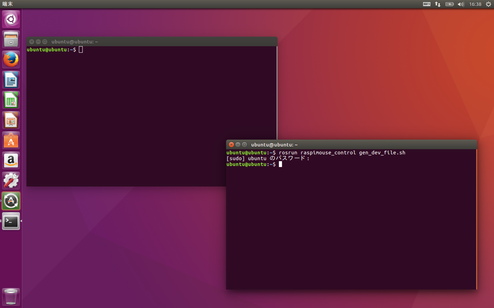

# Raspberry Pi Mouse Simulatorの動作確認

## 概要

シミュレータを起動し、画面上にRaspberry Pi Mouseが出現することを確認してみましょう。

## 動作確認手順

シミュレータの起動とシミュレータの操作は同じTerminalのウィンドウではできません。 そこで、Terminalをウィンドウを2つ開き、一方でシミュレータを起動、もう一方でシミュレータの操作をします。


まず、1枚目のウィンドウでシミュレータ用のデバイスファイルを作成します。次のコマンドを入力します（管理者権限が必要です）。

```bash
rosrun raspimouse_control gen_dev_file.sh
```



次に、同じ1枚目のウィンドウでシミュレータを起動します。

```text
roslaunch raspimouse_gazebo raspimouse_with_samplemaze.launch use_devfile:=true
```


`raspimouse_with_samplemaze.launch`では3x3の簡易迷路が環境として指定されています。  
Gazeboが起動しますのでしばらく待ちます。


Gazeboが起動できたのを確認したら、2枚目のウィンドウで以下のコマンドを入力します。

```text
cat /dev/rtlightsensor0
```


画像のように`37 65 516 36`など4種類の数字が表示されていればきちんと距離センサがシミュレートできています。

終了するときは、Gazeboのウィンドウの左上にある×ボタンを押すか、Gazeboを起動したターミナルで`Cont`キーと`C`キーを同時に押します。

  
以上で起動確認は完了です。

