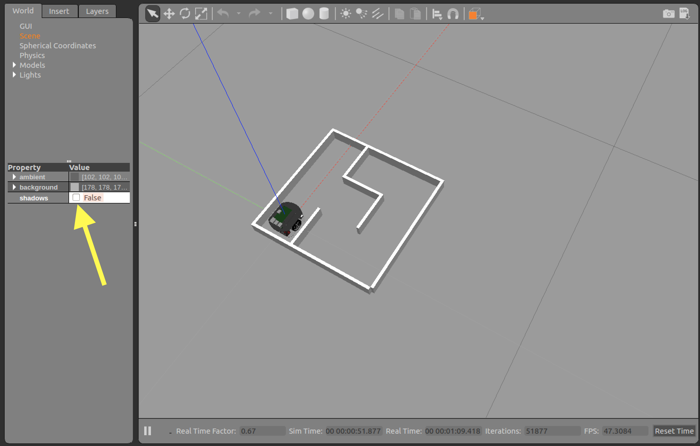

# ROSのトラブルシューティング

## Gazebo上のラズパイマウスが動かない

ros-control関連のパッケージが不足しているとラズパイマウスが動きません。 以下のコマンドで追加パッケージをインストールしてください。

```bash
cd ~/catkin_ws/src && rosdep install -r -y -from-paths raspimouse_sim
```

## master may not be running yet

```bash
Unable to register with master node [http://127.0.0.1:11311]: master may not be running yet. Will keep trying.
```

publishするノードに接続できない状態です。

`roslaunch`でlaunchファイルを呼び出している場合はもう一度launchできているかどうか確認してください。

その他の場合は`roscore`がエラーなく起動できているか確認してください。

`roslaunch`をそのまま実行できない場合、`roscore`を別プロセスとして起動してから実行するとうまく行く場合が多いです。

## catkin\_make failed

```bash
$ catkin_make
Base path: /home/ubuntu/catkin_ws
Source space: /home/ubuntu/catkin_ws/src
Build space: /home/ubuntu/catkin_ws/build
Devel space: /home/ubuntu/catkin_ws/devel
Install space: /home/ubuntu/catkin_ws/install
####
#### Running command: "make cmake_check_build_system" in "/home/ubuntu/catkin_ws/build"
####
####
#### Running command: "make -j8 -l8" in "/home/ubuntu/catkin_ws/build"
####
```

上記のようになにもビルドせず、目的のパッケージのcatkin\_makeに失敗する場合があります。

その際には以下のコマンドを実行してから再度catkin\_makeを実行してみてください。

```bash
source ~/catkin_ws/devel/setup.bash
```

## Gazeboの動作がカクカクする/Gazeboのフレームレートが低い

描画が間に合っていない場合、Gazebo上のロボットの動きが鈍く見えます。 陰を描画しないようにすることでほとんどの場合は動作が改善します。

GazeboのWorldにあるsceneをクリックします。 

次にPropertyにあるshadowsがTrueになっているため、チェックを外しFalseにします。 

## rtlightsensorについてのエラーが出る

```bash
[ERROR] [1515648685.827463, 0.414000]: failed to open rtlightsensor0
```

デバイスファイルにアクセスができない場合、上記のエラーが繰り返し出ます。

以下のコマンドを実行してください。一度実行していれば、二度目に実行する必要はありません。

```bash
rosrun raspimouse_control gen_dev_file.sh
```

